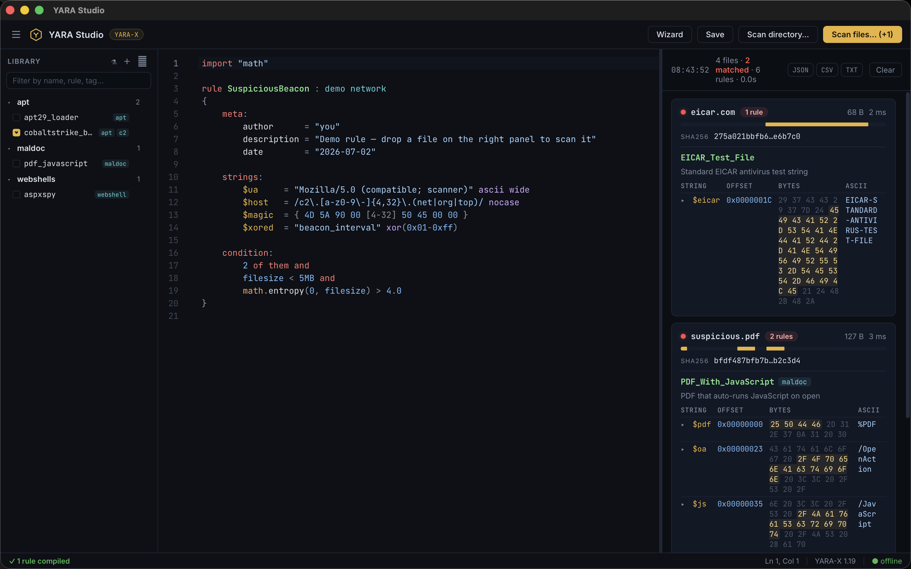
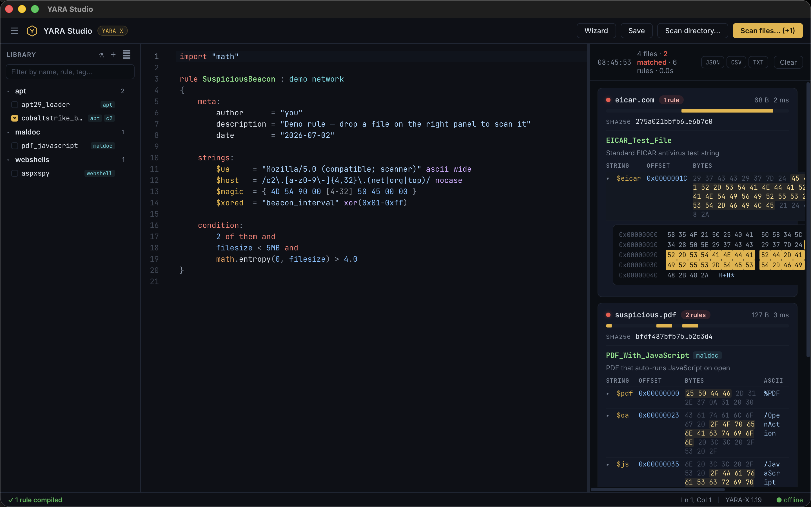
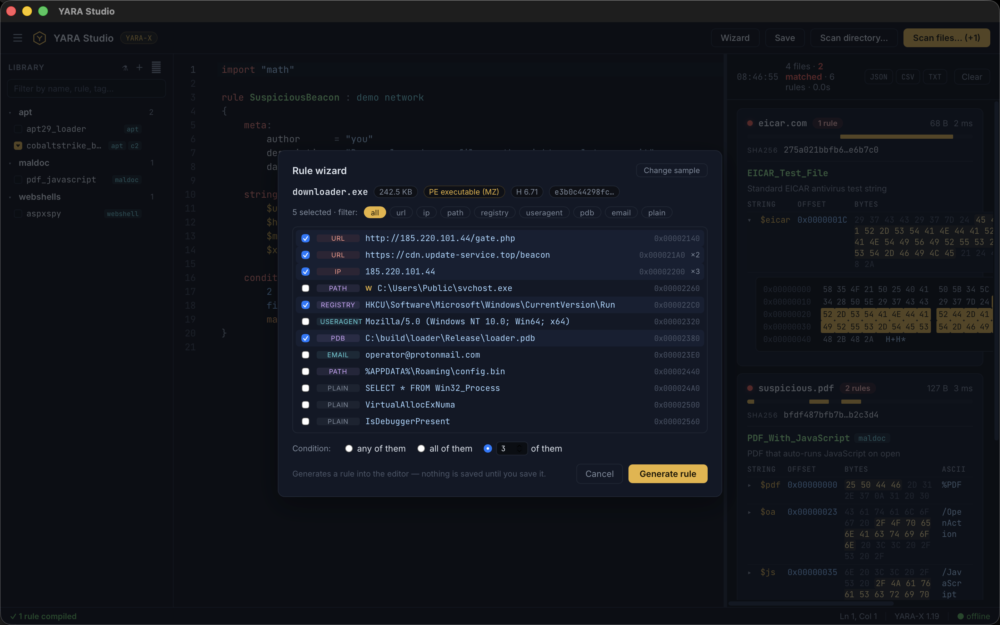

<div align="center">


# YARA Studio

**Offline desktop studio for writing, testing and managing YARA rules.**

Write a rule, drop a sample on it, and see exactly which bytes matched —
without uploading anything, anywhere.

[](https://github.com/platinum2high/yara-studio/actions/workflows/ci.yml)


[](LICENSE)

[**⬇️ Download**](#-download--install) · [Features](#-features) · [How it works](#-how-it-works) · [Build from source](#-build-from-source) · [License](#-license)

</div>

<p align="center">
  
</p>

---

## Why

Analysts write YARA rules all day, but the loop is clumsy: edit a rule in one
tool, run `yara` in a terminal, eyeball the output, guess which string fired,
repeat. Online sandboxes close the loop — but you have to **upload the sample**,
a non-starter for anything sensitive.

YARA Studio is that whole loop in one **100% offline** desktop app. No APIs, no
telemetry, no cloud. Your rules and your samples never leave the machine.

---

## ⬇️ Download & Install

> **No coding required.** It's a normal desktop app — download one file and
> double-click, like installing a game. You do **not** need Python, Node,
> Docker, or the command line.

**1. Grab the file for your system** from the
[**Releases page**](https://github.com/platinum2high/yara-studio/releases/latest):

| Your system | Download this file |
|-------------|--------------------|
| 🍎 **macOS** (Apple Silicon *or* Intel) | `YARA.Studio_x.x.x_universal.dmg` |
| 🪟 **Windows 10 / 11** | `YARA.Studio_x.x.x_x64-setup.exe` or `.msi` |
| 🐧 **Linux** (most distros) | `yara-studio_x.x.x_amd64.AppImage` |
| 🐧 **Debian / Ubuntu** | `yara-studio_x.x.x_amd64.deb` |

**2. Install it:**

<details open>
<summary><b>🍎 macOS</b></summary>

1. Double-click the `.dmg`, then drag **YARA Studio** into your **Applications** folder.
2. The first time you open it, macOS may say *"cannot be opened because the developer cannot be verified."* That's just because the app isn't code-signed yet — it's safe.
3. **Right-click** the app icon → **Open** → **Open**. You only need to do this once; after that it opens normally.

</details>

<details>
<summary><b>🪟 Windows</b></summary>

1. Run the `.exe` (or `.msi`) installer and follow the prompts.
2. Windows SmartScreen may show *"Windows protected your PC"* — again, only because it isn't signed yet.
3. Click **More info** → **Run anyway**.

</details>

<details>
<summary><b>🐧 Linux</b></summary>

**AppImage** (works almost everywhere):
```sh
chmod +x yara-studio_*_amd64.AppImage
./yara-studio_*_amd64.AppImage
```

**Debian / Ubuntu** (`.deb`):
```sh
sudo apt install ./yara-studio_*_amd64.deb
```

</details>

**3. Open it and go.** The editor starts with an example rule — drag any file
onto the right-hand panel to scan it. That's it.

> 💡 The installers aren't code-signed yet, which is why macOS/Windows show a
> one-time warning. The full source is in this repo and every release is built
> in public CI, so you can verify exactly what you're running.

---

## ✨ Features

- **Rule editor** — full YARA syntax highlighting, autocomplete and live
  validation. Compile errors are underlined as you type, with the exact line
  and message straight from the compiler.
- **Drag & drop scanning** — drop files *or whole directories* onto the app.
  Trees are walked recursively with a live progress counter and a cancel button.
- **Precise match display** — every matched string with its offset, matched
  bytes (hex + ASCII) in context, and the XOR key when the `xor` modifier fired.
- **In-context hex view** — click any match to open a hex dump of the
  surrounding file region with the matched bytes highlighted.
- **Rule library** — save rules into taggable collections, filter by name /
  rule / tag / description. Stored as plain `.yar` files you can keep in git.
- **Multi-rule scanning** — tick library rules to compile them into the scan
  set alongside the editor; each match shows which file the rule came from.
- **Regression tests** — attach *must-match* and *must-not-match* samples to a
  rule; one click re-runs the whole library and flags any rule that drifted.
- **Rule wizard** — point it at a sample; it extracts and ranks strings by IOC
  value and drafts a starting rule from your selection.
- **Reports** — export any scan as JSON, CSV (one row per string match,
  SIEM-import friendly) or plain text. SHA-256 for every file, click to copy.
- **Dark theme**, resizable panes, keyboard-first (`⌘/Ctrl+S` to save).

### Inspect matched bytes in file context

<p align="center">
  
</p>

### Bootstrap a rule from a sample

<p align="center">
  
</p>

---

## 🔬 How it works

YARA Studio embeds [YARA-X](https://virustotal.github.io/yara-x/) — the
official Rust implementation of YARA by VirusTotal — statically compiled into
the binary. All standard modules ship with it: `pe`, `elf`, `macho`, `dotnet`,
`math`, `hash`, `string`, `time`, `lnk`, `dex`, `zip` and more.

Rule compatibility is the project's biggest risk, so it is pinned by tests:
[`src-tauri/tests/compat.rs`](src-tauri/tests/compat.rs) exercises the language
surface the app relies on — string modifiers, hex patterns with jumps and
alternatives, regexes, match counters/offsets, and module functions.

| Layer | Technology |
|-------|------------|
| Scan engine | [yara-x](https://crates.io/crates/yara-x) (Rust, statically linked) |
| Desktop shell | [Tauri 2](https://tauri.app/) |
| UI | Svelte 5 + TypeScript |
| Editor | CodeMirror 6 with a hand-written YARA language mode |

---

## 🛠 Build from source

*Only needed if you want to hack on it — regular users should just
[download](#-download--install) the installer.*

Requirements: [Rust](https://rustup.rs/) and [Node.js](https://nodejs.org/) 22+.

```sh
npm install
npm run tauri dev     # run the app in dev mode
npm run tauri build   # build a release bundle for the current OS
```

Tests:

```sh
cd src-tauri && cargo test   # engine: compiler, scanner, library, export, tests, wizard, compat
npm test                     # frontend: YARA tokenizer + rule generator
```

Cross-platform CI (fmt + clippy + tests + build) runs on **Ubuntu, macOS and
Windows** for every push. Tagging `v*` builds installers for all three OSes.

---

## 📜 License

YARA Studio is **dual-licensed**:

- **Open source:** [GNU AGPL-3.0](LICENSE) — free to use, run, study, modify
  and share. If you distribute it or offer it over a network, you must make
  your source available under the same license. For everyday use — running it,
  using it at work, modifying it for yourself — this changes nothing.
- **Commercial:** want to embed YARA Studio in a **closed-source product** or
  ship it in a proprietary appliance/SaaS without AGPL's copyleft? A commercial
  license is available — see [COMMERCIAL.md](COMMERCIAL.md).

Copyright © 2026 Artem Shymko.
